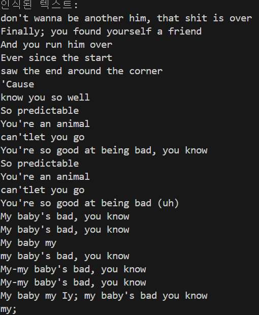
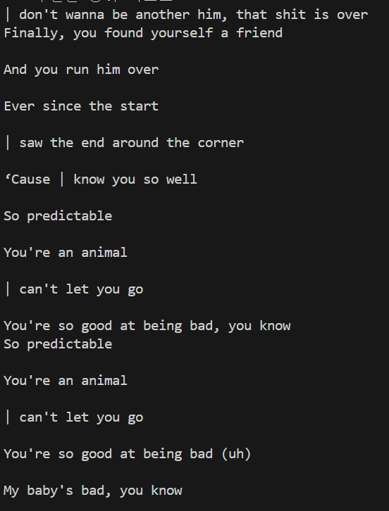

# OCR 프로젝트: easyocr vs. pytesseract

이 프로젝트는 Python의 두 가지 대표적인 OCR(광학 문자 인식) 라이브러리인 `easyocr`과 `pytesseract`를 사용하여 이미지에서 텍스트를 추출하는 방법을 비교하고 기록하기 위해 만들어졌습니다.

## 📝 목차

-  [프로젝트 개요](#-프로젝트-개요)
-  [사용한 라이브러리](#-사용한-라이브러리)
-  [설치 및 설정 과정](#-설치-및-설정-과정)
    -  [Python 라이브러리 설치](#python-라이브러리-설치)
    -  [Tesseract-OCR 엔진 설치 (pytesseract 사용 시 필수)](#tesseract-ocr-엔진-설치-pytesseract-사용-시-필수)
    -  [설치 과정에서 발생할 수 있는 문제 및 해결](#설치-과정에서-발생할-수-있는-문제-및-해결)
-  [파일 설명](#-파일-설명)
    -  [프로젝트 루트 (`ocr_project/`)](#프로젝트-루트-ocr_project)
    -  [`easyocr/` 폴더](#easyocr-폴더)
    -  [`pytesseract/` 폴더](#pytesseract-폴더)
    -  [`images/` 폴더](#images-폴더)
-  [실행 방법](#▶️-실행-방법)
-  [실행 결과](#✨-실행-결과)
    -  [easyocr 결과](#easyocr-결과)
    -  [pytesseract 결과](#pytesseract-결과)
-  [OCR 인식률이 잘 나오지 않는 이유](#ocr-인식률이-잘-나오지-않는-이유)
-  [배운 점 및 회고](#💡-배운-점-및-회고)

## 📖 프로젝트 개요

`image.png` 파일에 포함된 영어와 한국어 텍스트를 `easyocr`과 `pytesseract`를 이용해 각각 추출하고, 그 과정과 결과를 비교 분석합니다. 이를 통해 각 라이브러리의 장단점과 사용법을 익힙니다.

## 📚 사용한 라이브러리

-  **easyocr**: GPU를 활용할 수 있으며, 다국어 지원이 강력한 사용자 친화적인 OCR 라이브러리입니다.
-  **pytesseract**: Google의 Tesseract OCR 엔진을 Python에서 사용할 수 있도록 하는 래퍼(wrapper) 라이브러리입니다.

## ⚙️ 설치 및 설정 과정

### Python 라이브러리 설치

프로젝트에 필요한 Python 라이브러리들을 설치합니다. 가상 환경을 사용하는 것을 권장합니다.

```bash
# 가상 환경 생성 (선택 사항이지만 권장)
python -m venv venv
# 가상 환경 활성화 (Windows)
.\venv\Scripts\activate
# 가상 환경 활성화 (macOS/Linux)
source venv/bin/activate

# easyocr과 의존성 라이브러리 설치
pip install easyocr

# pytesseract 설치
pip install pytesseract
```

### Tesseract-OCR 엔진 설치 (pytesseract 사용 시 필수)

`pytesseract`는 Tesseract 엔진이 시스템에 별도로 설치되어 있어야 합니다.

-  **Windows:** [Tesseract 공식 설치 프로그램](https://github.com/UB-Mannheim/tesseract/wiki)을 다운로드하여 설치합니다.
    -   설치 과정에서 **"Add Tesseract to the system PATH"** 옵션을 반드시 체크하는 것이 좋습니다. 이렇게 하면 스크립트에서 Tesseract 실행 파일의 경로를 직접 지정할 필요가 없어집니다.
    -   만약 PATH에 추가하지 않았다면, Python 스크립트 상단에 다음과 같이 경로를 명시해야 합니다.
        ```python
        import pytesseract
        pytesseract.pytesseract.tesseract_cmd = r'C:\Program Files\Tesseract-OCR\tesseract.exe'
        ```
-  **macOS (Homebrew 사용):**
    ```bash
    brew install tesseract
    brew install tesseract-lang
    ```
-  **Linux (Ubuntu/Debian):**
    ```bash
    sudo apt update
    sudo apt install tesseract-ocr
    sudo apt install tesseract-ocr-kor tesseract-ocr-eng # 한국어, 영어 언어팩 설치
    ```

### 설치 과정에서 발생할 수 있는 문제 및 해결

1.  **`pytesseract.pytesseract.TesseractNotFoundError: tesseract is not installed or it's not in your PATH` 오류:**
    *   **원인:** Tesseract OCR 엔진이 설치되지 않았거나, 설치되었더라도 시스템 PATH에 등록되지 않아 `pytesseract` 라이브러리가 Tesseract 실행 파일을 찾지 못하는 경우입니다.
    *   **해결:** 위 "Tesseract-OCR 엔진 설치" 섹션을 참조하여 Tesseract를 올바르게 설치하고, PATH에 추가되었는지 확인합니다. Windows의 경우 설치 시 "Add Tesseract to the system PATH" 옵션을 체크하거나, 수동으로 환경 변수를 설정해야 합니다. 또는 `pytesseract.pytesseract.tesseract_cmd`에 Tesseract 실행 파일의 절대 경로를 직접 지정해 줍니다.

2.  **`ModuleNotFoundError: No module named 'easyocr'` 또는 `No module named 'pytesseract'` 오류:**
    *   **원인:** 해당 Python 라이브러리가 현재 활성화된 Python 환경에 설치되지 않은 경우입니다.
    *   **해결:** `pip install easyocr` 또는 `pip install pytesseract` 명령어를 사용하여 라이브러리를 설치합니다. 가상 환경을 사용 중이라면, 가상 환경이 올바르게 활성화되었는지 확인한 후 설치를 진행합니다.

3.  **OCR 결과가 제대로 나오지 않는 경우 (언어팩 문제):**
    *   **원인:** Tesseract의 경우, 인식하려는 언어에 해당하는 언어팩이 설치되지 않았거나, 코드에서 올바른 언어 코드를 지정하지 않은 경우입니다. `easyocr`의 경우에도 모델 다운로드에 실패했거나, 지원하지 않는 언어를 지정한 경우 발생할 수 있습니다.
    *   **해결:** Tesseract의 경우 `tesseract-ocr-kor` (한국어), `tesseract-ocr-eng` (영어) 등 필요한 언어팩을 설치했는지 확인합니다. 코드에서 `lang='kor'` 또는 `lang='eng'`와 같이 올바른 언어 코드를 사용했는지 확인합니다.

## 📄 파일 설명

### 프로젝트 루트 (`ocr_project/`)

-  `README.md`: 현재 보고 계신 프로젝트 설명 문서입니다.
-  `image.png`: `easyocr`과 `pytesseract`를 통해 텍스트를 추출할 대상 이미지 파일입니다. (프로젝트 루트에 위치)

### `easyocr/` 폴더

`easyocr` 라이브러리를 사용하여 OCR을 수행하는 예제 코드가 포함되어 있습니다.

-  `easy_ocr_example.py`: `easyocr` 라이브러리를 사용하여 `image.png`에서 한국어와 영어 텍스트를 추출합니다.
-  `image.png`: `easyocr` 예제에서 사용되는 이미지 파일 (프로젝트 루트의 `image.png`와 동일한 파일).
-  `.git/`: Git 버전 관리 시스템 관련 파일들이 저장된 디렉토리입니다.

### `pytesseract/` 폴더

`pytesseract` 라이브러리를 사용하여 OCR을 수행하는 예제 코드가 포함되어 있습니다.

-  `1.jpeg`: `pytesseract` 예제에서 사용될 수 있는 추가 이미지 파일.
-  `image.png`: `pytesseract` 예제에서 사용되는 이미지 파일 (프로젝트 루트의 `image.png`와 동일한 파일).
-  `ocr_en.py`: `pytesseract`를 사용하여 `image.png`에서 영어 텍스트를 추출합니다.
-  `ocr.py`: `pytesseract`를 사용하여 `image.png`에서 한국어 텍스트를 추출합니다.

### `images/` 폴더

OCR 결과 이미지를 저장하는 폴더입니다.

-  `1.png`: `easyocr`을 사용하여 `image.png`에서 텍스트를 추출한 결과 이미지입니다.
-  `2.png`: `pytesseract`를 사용하여 `image.png`에서 텍스트를 추출한 결과 이미지입니다.

## ▶️ 실행 방법

각 스크립트는 터미널에서 다음 명령어를 통해 실행할 수 있습니다. (프로젝트 루트 디렉토리에서 실행한다고 가정)

```bash
# easyocr 예제 실행
python easyocr/easy_ocr_example.py

# pytesseract 한국어 예제 실행
python pytesseract/ocr.py

# pytesseract 영어 예제 실행
python pytesseract/ocr_en.py
```

## ✨ 실행 결과

### easyocr 결과

`easyocr`을 사용하여 `image.png`에서 텍스트를 추출한 결과입니다.



```
인식된 텍스트:
don't wanna be another him, that shit is over
Finally; you found yourself a friend
And you run him over
Ever since the start
saw the end around the corner
'Cause
know you so well
So predictable
... (이하 생략)
```

### pytesseract 결과

`pytesseract`를 사용하여 `image.png`에서 텍스트를 추출한 결과입니다.



```
'image.png' 파일에서 영어 텍스트를 추출합니다...

--- 추출된 영어 텍스트 ---
| don't wanna be another him, that shit is over
Finally, you found yourself a friend

And you run him over
... (이하 생략)
--------------------------
```

## OCR 인식률이 잘 나오지 않는 이유

OCR 인식률은 다양한 요인에 의해 영향을 받습니다. 결과가 기대만큼 좋지 않다면 다음 사항들을 고려해 볼 수 있습니다.

1.  **이미지 품질:**
    *   **해상도:** 이미지가 너무 저해상도이면 문자를 정확히 인식하기 어렵습니다. 최소 300 DPI 이상의 해상도가 권장됩니다.
    *   **노이즈:** 이미지에 불필요한 점, 선, 얼룩 등의 노이즈가 많으면 OCR 엔진이 문자와 노이즈를 구분하기 어려워집니다.
    *   **선명도/초점:** 이미지가 흐리거나 초점이 맞지 않으면 문자의 경계가 불분명해져 인식률이 떨어집니다.
    *   **조명:** 고르지 못한 조명은 그림자를 만들거나 특정 부분이 너무 밝거나 어둡게 만들어 인식에 방해가 됩니다.

2.  **텍스트 특성:**
    *   **폰트:** 너무 특이하거나 장식적인 폰트, 또는 매우 작거나 얇은 폰트는 인식하기 어렵습니다.
    *   **크기:** 텍스트 크기가 너무 작거나 너무 크면 인식률이 저하될 수 있습니다.
    *   **색상 대비:** 텍스트와 배경의 색상 대비가 낮으면 문자를 구분하기 어렵습니다.
    *   **정렬/회전:** 텍스트가 기울어져 있거나 회전되어 있으면 OCR 엔진이 문자를 올바르게 정렬하고 인식하는 데 어려움을 겪습니다.
    *   **언어:** OCR 엔진이 해당 언어를 지원하지 않거나, 해당 언어에 대한 학습 데이터가 부족하면 인식률이 낮아집니다. (예: 한국어 텍스트를 영어 언어팩으로 인식 시도)

3.  **전처리 부족:**
    *   OCR을 수행하기 전에 이미지에 대한 적절한 전처리(예: 이진화, 노이즈 제거, 기울기 보정, 대비 향상, 크롭 등)를 거치지 않으면 인식률이 낮아질 수 있습니다.

4.  **OCR 엔진/모델의 한계:**
    *   모든 OCR 엔진이 모든 종류의 텍스트나 이미지에 대해 완벽한 성능을 보이는 것은 아닙니다. 특정 엔진은 특정 언어나 폰트에 더 강할 수 있습니다.
    *   `easyocr`이나 `pytesseract` 모두 딥러닝 기반이지만, 복잡한 레이아웃, 손글씨, 예술적인 폰트 등에는 여전히 한계가 있습니다.

## 💡 배운 점 및 회고

-  **easyocr의 편리함**: `pip install` 명령어 한 줄로 설치가 끝나고, 한국어와 영어를 동시에 인식하는 과정이 매우 간단했습니다. 별도의 엔진 설치나 경로 설정이 필요 없어 사용자 친화적이라고 느꼈습니다. 다만, GPU가 없으면 속도가 느릴 수 있다는 경고 메시지를 통해 성능 최적화의 중요성을 알게 되었습니다.

-  **pytesseract의 설정**: `pytesseract`는 라이브러리 설치 외에도 Tesseract OCR 엔진을 별도로 설치하고, 시스템 PATH에 추가하거나 코드 내에서 경로를 지정해야 하는 번거로움이 있었습니다. 이 과정을 통해 라이브러리와 엔진의 관계, 그리고 환경 변수의 중요성에 대해 배울 수 있었습니다.

-  **경로 문제 해결**: 처음에는 `tesseract_cmd` 경로를 하드코딩하는 방식을 사용했지만, 이는 다른 환경에서 코드를 실행할 때 문제를 일으킬 수 있다는 점을 깨달았습니다. 환경 변수(PATH)에 등록하는 것이 훨씬 더 유연하고 안정적인 방법이라는 것을 배웠습니다. 또한, 가상 환경의 중요성을 다시 한번 인지하게 되었습니다.

-  **결과의 미묘한 차이**: 두 라이브러리의 OCR 결과가 완전히 동일하지는 않았습니다. 문장 부호나 줄 바꿈 등에서 약간의 차이를 보였는데, 이를 통해 OCR 엔진의 특성에 따라 결과가 달라질 수 있음을 확인했습니다. 어떤 라이브러리를 선택할지는 프로젝트의 요구사항(지원 언어, 정확도, 설치 편의성 등)에 따라 달라질 것 같습니다.

-  **OCR 전처리의 중요성**: 단순히 이미지를 OCR 엔진에 넣는 것만으로는 최상의 결과를 얻기 어렵다는 것을 알게 되었습니다. 이미지의 품질, 텍스트의 특성 등을 고려하여 적절한 전처리 과정을 거치는 것이 OCR 인식률을 높이는 데 매우 중요함을 깨달았습니다.